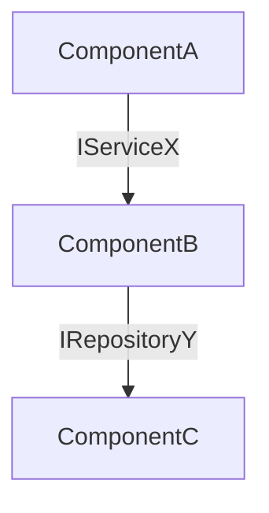

# RBD File Formats

## .rbd/config.yml

```yaml
id_format:
  categories: [FUNC, TECH, PERF, UI, CONF]
  levels: ["domain", "feature"]       # intermediate level names — negotiated at init
  example: "FUNC-AUTH-LOGIN-001"

test_tagging:
  language: python
  convention: "@pytest.mark.req('{id}')"  # {id} is replaced with the requirement ID at generation time

linter:
  command: "ruff check ."
```

## .rbd/plan-files.yml

```yaml
plan_files:
  # Project workflow files — always present at these paths
  - .rbd/config.yml
  - .rbd/plan-files.yml
  - requirements/functional.md
  - requirements/technical.md
  - requirements/performance.md
  - requirements/ui.md
  - requirements/configuration.md
  - audits/exclusions.yml

  # Plugin skill files — add these only if the plugin is installed locally
  # in this project's .claude/ directory (not a global installation).
  # Paths depend on installation: check .claude/plugins/rbd/ or .claude/agents/.
  # Example (local install):
  #   - .claude/plugins/rbd/skills/rbd/SKILL.md
  #   - .claude/plugins/rbd/skills/rbd-audit/SKILL.md
  #   - .claude/plugins/rbd/skills/rbd-review/SKILL.md
  #   - .claude/agents/audit-traceability.md
  #   - .claude/agents/audit-coherence.md
  #   - .claude/agents/requirement-analyst.md
  #   - .claude/agents/test-builder.md
  #   - .claude/agents/code-builder.md
```

Update this file whenever a new workflow file is added to the project. The update itself is a `plan:` commit.

## requirements/<category>.md

Each category file has a header and one entry per requirement:

```markdown
# Functional Requirements

### FUNC-AUTH-LOGIN-001
**Title:** User can log in with email and password
**Status:** draft | validated | deprecated
**Dependencies:** TECH-DB-001
**Description:** The system must allow a user to authenticate using a valid email address and
password combination. On success, a session token is returned. On failure, a clear error message
is displayed without revealing whether the email or password was wrong.
```

`deprecated` is used only when a requirement was historically validated and implemented, then later
superseded. Requirements split before any commit are deleted without trace — they have no history.

## audits/exclusions.yml

```yaml
exclusions:
  - id: AUTH-OVERLAP-001
    finding: "FUNC-AUTH-001 and FUNC-AUTH-002 overlap semantically"
    justification: "FUNC-AUTH-002 is intentionally a specialization of FUNC-AUTH-001 covering a distinct authentication provider."
    date: 2026-05-27
```

## Commit Format

```
# Standard — one requirement
req(FUNC-AUTH-LOGIN-001): add login requirement
test(FUNC-AUTH-LOGIN-001): integration test for email/password login
feat(FUNC-AUTH-LOGIN-001): implement email/password login
tech(TECH-DB-001): implement connection pooling
perf(PERF-API-001): optimize query response time
ui(UI-FORM-001): implement login form
conf(CONF-HTTP-TIMEOUT-001): set HTTP request timeout to 30s
arch(FUNC-AUTH-001): add AuthService and IUserRepository to component diagram
plan: add Jest/TypeScript tagging support to rbd config

# Multi-requirement (avoid — suggest splitting instead)
feat: shared authentication middleware

Requirements: FUNC-AUTH-LOGIN-001, FUNC-AUTH-SSO-001
```

## Empty requirements file template

When creating `requirements/<category>.md` during init:

```markdown
# <Category> Requirements

<!-- Requirements are added here during Phase 2 of the RBD workflow. -->
<!-- Format: req(ID): title -->
```

During init, create one file per category: `functional.md`, `technical.md`, `performance.md`, `ui.md`, `configuration.md`.

## Test Structure

### Given / When / Then

Every test function uses three comment sections as structural markers:

```python
@pytest.mark.req('FUNC-AUTH-LOGIN-001')
def test_login_returns_token_on_valid_credentials():
    # Given
    user = User(email="alice@example.com", password_hash=hash("secret"))
    db.save(user)

    # When
    result = auth_service.login("alice@example.com", "secret")

    # Then
    assert result.token is not None
    assert result.user_id == user.id
```

One `When` per test. If you need two actions, it is two tests.

### Parametrized tests

Use a parameter table when the requirement has multiple input/output cases.
The tag goes on the parametrized function, not on individual cases.

**Python (pytest):**
```python
@pytest.mark.req('FUNC-AUTH-LOGIN-001')
@pytest.mark.parametrize("email,password,expected_error", [
    ("alice@example.com", "wrong",   "invalid_credentials"),
    ("nobody@example.com", "secret", "user_not_found"),
    ("alice@example.com", "",        "password_required"),
], ids=["wrong-password", "unknown-user", "empty-password"])
def test_login_error_cases(email, password, expected_error):
    # Given
    db.save(User(email="alice@example.com", password_hash=hash("secret")))

    # When
    result = auth_service.login(email, password)

    # Then
    assert result.error == expected_error
```

**JavaScript (Jest/Vitest):**
```javascript
const cases = [
  { id: "wrong-password",  email: "alice@example.com",  password: "wrong",  error: "invalid_credentials" },
  { id: "unknown-user",    email: "nobody@example.com", password: "secret", error: "user_not_found" },
];

test.each(cases)("login error: $id — req:FUNC-AUTH-LOGIN-001", async ({ email, password, error }) => {
  // Given
  await db.save({ email: "alice@example.com", passwordHash: hash("secret") });

  // When
  const result = await authService.login(email, password);

  // Then
  expect(result.error).toBe(error);
});
```

Adding a new edge case = adding one row to the table. No new function, no duplication.

## docs/architecture.md

Created during Phase 3 (first requirement). Updated after every requirement change.

```markdown
# Architecture

_Last updated: YYYY-MM-DD — requirement: ID_

## Component Diagram



## Component Responsibilities

| Component | Responsibility | Requirement(s) |
|-----------|----------------|----------------|
| ComponentA | Handles authentication | FUNC-AUTH-001 |

## Dependency Injection Map

| Component | Receives | Interface | Requirement |
|-----------|----------|-----------|-------------|
| AuthService | UserRepository | IUserRepository | TECH-DI-001 |

## Requirement → Component Traceability

| Requirement | Component(s) | Notes |
|-------------|-------------|-------|
| FUNC-AUTH-001 | AuthService | entry point for login flow |
```

`docs/architecture.md` is tracked separately from `plan-files.yml`. Every modification must have an `arch(ID):` commit where `ID` is the triggering requirement. The traceability agent checks this via T5.
